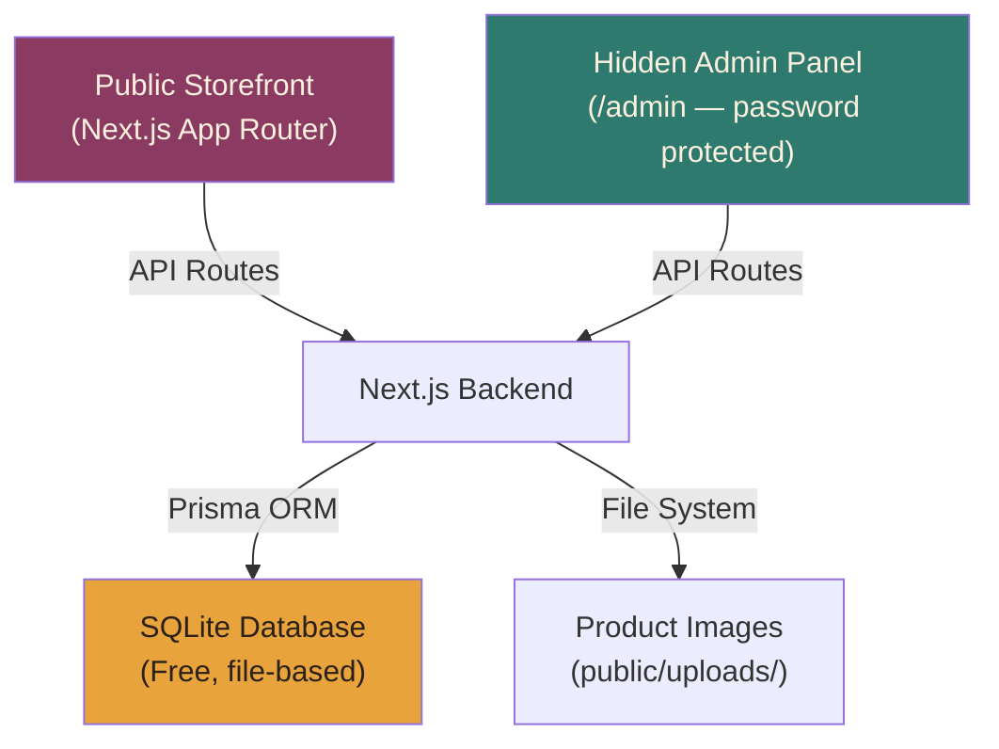

# Shinghorin — Arts & Crafts E-Commerce Website

A full-featured e-commerce website for selling arts & crafts items, built with Next.js and SQLite, faithfully reproducing the provided design template's sketchbook-page aesthetic.

## Architecture Overview



## Tech Stack

| Layer | Technology | Cost |
|-------|-----------|------|
| **Framework** | Next.js 15 (App Router) | Free |
| **Styling** | Tailwind CSS v4 (matching your template) | Free |
| **Database** | SQLite via Prisma ORM | **Free** — file-based, no server needed |
| **Auth (Admin)** | Simple password session (bcrypt + iron-session) | Free |
| **Image Storage** | Local filesystem (`public/uploads/`) | Free |
| **Hosting** | Vercel / VPS (your choice) | Paid (domain + hosting) |

> [!IMPORTANT]
> **Why SQLite?** It's completely free, requires zero setup, stores everything in a single file, and handles thousands of products easily. Perfect for a small-to-medium e-commerce store. No external database service needed.

## User Review Required

> [!IMPORTANT]
> **Hosting Choice**: SQLite works perfectly on VPS hosting (DigitalOcean, Hetzner, Railway). Vercel's serverless functions have limitations with SQLite file persistence. The user guide will cover both options, but **a $5/month VPS is recommended** for the simplest SQLite experience. Alternatively, we can use Turso (free tier SQLite cloud) for Vercel deployment.

> [!WARNING]
> **Admin Authentication**: The admin panel will be protected by a single username/password login. The credentials will be set via environment variables (`ADMIN_USERNAME` and `ADMIN_PASSWORD`). This is simple and secure enough for a single-admin store. No user registration system is needed.

## Open Questions

1. **WhatsApp Number**: Your template uses `8801848335770` — should I keep this number, or will you update it later?
2. **Payment**: Your template uses Cash on Delivery via WhatsApp. Should I keep this exact checkout flow, or add any online payment integration?
3. **Categories**: Your template has 6 categories (Bag Charms, Flowers, Keychains, Plushies, Caricature, Portraits). Should I keep these as the starting categories, or do you want different ones for the arts & crafts store?
4. **Delivery Info**: Keep "Dhaka-wide delivery, Cash on Delivery" messaging, or change it?

---

## Proposed Changes

### 1. Project Setup & Configuration

#### [NEW] `package.json` — Next.js project with all dependencies
- next, react, react-dom
- prisma, @prisma/client (SQLite ORM)
- iron-session (lightweight session management for admin)
- bcryptjs (password hashing)
- tailwindcss v4
- sharp (image optimization)
- recharts (simple analytics charts)

#### [NEW] `next.config.js` — Next.js configuration
#### [NEW] `tailwind.config.ts` — Tailwind config with custom design tokens from your template
#### [NEW] `.env.example` — Environment variable template

---

### 2. Database Schema (Prisma + SQLite)

#### [NEW] `prisma/schema.prisma`

```
Category  { id, name, slug, chipColor, sortOrder, createdAt }
Product   { id, categoryId, name, bnName, description, badge, price, variants(JSON), images(JSON), isActive, sortOrder, createdAt, updatedAt }
PageView  { id, page, referrer, userAgent, createdAt }
Order     { id, customerName, phone, address, preferredDate, items(JSON), total, status, createdAt }
```

> [!NOTE]
> The `Order` table logs orders placed via WhatsApp checkout (same flow as your template), giving you order history in the admin panel without needing the Google Sheets webhook.

---

### 3. Public Storefront (Faithful to Your Design)

Every visual element from your template will be preserved:

#### [NEW] `src/app/layout.tsx` — Root layout with fonts (Baloo 2, Quicksand, Kalam, Space Mono, Noto Serif Bengali)
#### [NEW] `src/app/globals.css` — All design tokens and CSS from your template
#### [NEW] `src/app/page.tsx` — Home page with all sections:
- Fixed navigation bar with basket counter
- Hero section with Bengali text parallax, tagline, CTA buttons
- Ticker/marquee strip
- Stitch divider SVGs
- Collection grid (category tiles)
- Product catalog with filter pills
- Custom request section
- How to order steps
- Footer with contact info + "Developed by Roman" + GitHub link

#### [NEW] `src/components/Navbar.tsx` — Fixed nav with mobile menu + basket button
#### [NEW] `src/components/Hero.tsx` — Parallax hero with Bengali text overlays
#### [NEW] `src/components/Ticker.tsx` — Scrolling marquee strip
#### [NEW] `src/components/StitchDivider.tsx` — SVG chain stitch divider
#### [NEW] `src/components/CollectionGrid.tsx` — Category tile cards
#### [NEW] `src/components/ProductCatalog.tsx` — Filter pills + product grid
#### [NEW] `src/components/SpecimenCard.tsx` — Individual product card
#### [NEW] `src/components/ProductModal.tsx` — Product detail modal with carousel, size picker, qty stepper
#### [NEW] `src/components/CartDrawer.tsx` — Slide-out cart with checkout form (WhatsApp)
#### [NEW] `src/components/CustomRequest.tsx` — Custom order CTA section
#### [NEW] `src/components/HowToOrder.tsx` — 4-step order process
#### [NEW] `src/components/Footer.tsx` — Footer with "Developed by Roman" + GitHub link
#### [NEW] `src/components/Toast.tsx` — Toast notification system

---

### 4. API Routes

#### [NEW] `src/app/api/categories/route.ts` — GET all categories
#### [NEW] `src/app/api/products/route.ts` — GET products (with optional category filter)
#### [NEW] `src/app/api/orders/route.ts` — POST new order (logged when WhatsApp checkout fires)
#### [NEW] `src/app/api/analytics/route.ts` — GET analytics data (admin only)
#### [NEW] `src/app/api/admin/auth/route.ts` — POST login/logout
#### [NEW] `src/app/api/admin/products/route.ts` — CRUD products (admin only)
#### [NEW] `src/app/api/admin/products/[id]/route.ts` — GET/PUT/DELETE single product
#### [NEW] `src/app/api/admin/categories/route.ts` — CRUD categories (admin only)
#### [NEW] `src/app/api/admin/upload/route.ts` — POST image upload (admin only)

---

### 5. Hidden Admin Panel (`/admin`)

> [!NOTE]
> The admin panel is completely hidden — no link from the main site. Only accessible by typing `/admin` in the URL. Protected by password login.

#### [NEW] `src/app/admin/login/page.tsx` — Simple login form (username + password)
#### [NEW] `src/app/admin/page.tsx` — Admin dashboard with:
- Quick stats (total products, total orders, page views today)
- Recent orders list
- Simple analytics charts (views over time, top products)

#### [NEW] `src/app/admin/products/page.tsx` — Product management:
- List all products with search/filter
- Add new product (name, category, price, variants, images, badge, description)
- Edit product (update pricing, description, images)
- Delete product (with confirmation)
- Toggle active/inactive

#### [NEW] `src/app/admin/categories/page.tsx` — Category management:
- Add/edit/delete categories
- Reorder categories

#### [NEW] `src/app/admin/orders/page.tsx` — Order history:
- List all orders with status
- Update order status

#### [NEW] `src/app/admin/layout.tsx` — Admin layout with sidebar navigation

Admin panel styling: Clean, minimal dark UI that's functional but still uses your brand colors.

---

### 6. Analytics (Simple & Built-in)

#### [NEW] `src/middleware.ts` — Logs page views to SQLite (lightweight, no external service)
#### [NEW] `src/app/admin/analytics/page.tsx` — Analytics dashboard:
- Page views over time (line chart)
- Most viewed products
- Orders over time
- Revenue summary
- All rendered with Recharts (lightweight charting library)

---

### 7. Seed Data

#### [NEW] `prisma/seed.ts` — Seeds database with:
- All 6 categories from your template
- All products from your template with their descriptions, prices, badges

---

## Verification Plan

### Automated Tests
```bash
npm run build        # Verify the project builds without errors
npx prisma db push   # Verify database schema applies correctly
```

### Manual Verification
- Start dev server and verify all storefront sections render correctly
- Test product modal, cart drawer, and WhatsApp checkout flow
- Test admin login and product CRUD operations
- Test image upload
- Verify responsive design on mobile viewport
- Verify analytics tracking

---

## Post-Build Deliverable

### [NEW] `USER_GUIDE.md` — Complete setup & hosting guide covering:
1. Prerequisites (Node.js, npm)
2. Local development setup
3. Environment variables configuration
4. Database initialization
5. Adding your first products
6. **Hosting Option A**: Deploy to a VPS (DigitalOcean/Hetzner) — step by step
7. **Hosting Option B**: Deploy to Railway (managed, SQLite-compatible)
8. **Hosting Option C**: Deploy to Vercel with Turso (cloud SQLite)
9. Domain setup
10. SSL certificates
11. Ongoing maintenance (backups, updates)
